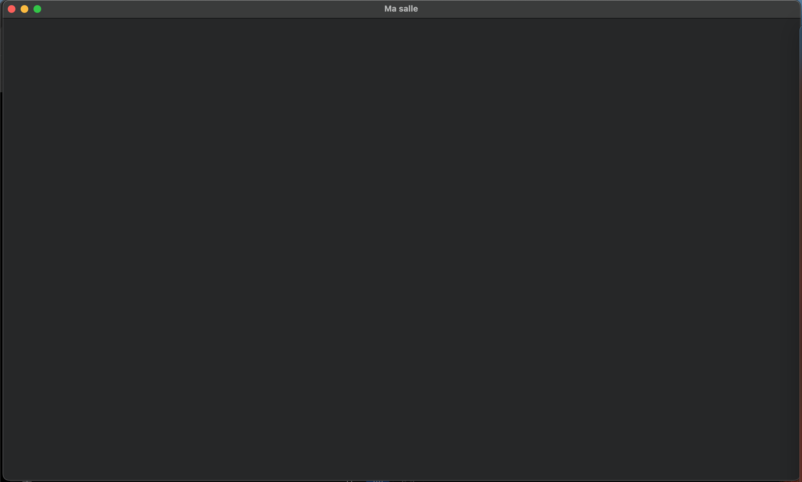

## Exercice 1 : La fenêtre nue
Écrivez le programme de quinze lignes de ce chapitre, construisez-le avec Jenga, et lancez-le.

Rendez le fichier .jenga et une capture de la fenêtre. Dites combien de temps cela vous a pris, honnêtement : ce nombre vous servira de référence pour mesurer vos progrès.

# Reponse
Créer une fenêtre, vérifier sa validité et maintenir son traitement d'événements.

On commence pars créer la configuration de la fenetre (les champ qui ne sont pas renseignés conservent leurs valeurs par défaut), on fixe les paramettres et les dimensions que l'on souhaite avoir. Pour verfier si la creation a abouti, on utilise ***IsValid***. On verifi parceque un constructeur qui ne lance pas d'exception en cas d'echec peut tout de meme produire un objet inutilisable. Donc la vérification évite de poursuivre l'éxecution avec une fenêtre qui n'a pas été crée correctement. Pour controler donc la poursuite de notre boucle, on utilise 
***IsOpen*** et par la suite ***PollEvents()*** pour traiter les événement en attente.

## Mon workspace fenetre.jenga
```md
```py
#!/usr/bin/env python3
# -*- coding: utf-8 -*-

# fenetre – Jenga Workspace
# Generated by `jenga workspace` on 2026-09-30 13:52:37

from Jenga import *

with workspace("fenetre"):
    useconfig("/Users/user/Nkentseu/Kit/kit.jenga")
    configurations(['Debug', 'Release'])
    targetoses([TargetOS.MACOS])
    targetarchs([TargetArch.X86_64, TargetArch.X86, TargetArch.ARM64, TargetArch.ARM, TargetArch.WASM32])
    
    # Default toolchain (auto-detected)
    # usetoolchain("host-gcc")
    
    # Uncomment to use Unitest testing framework
    # with unitest() as u:
    #     u.Precompiled()
    
    # Add your projects here
    # with project("MyApp"):
    #     consoleapp()
    #     language("C++")
    #     files(["src/**.cpp"])

    # Project: fenetre (fichier .jenga separe, inclus)
    with include("fenetre/fenetre.jenga"):
        pass
```

## Mon projet fenetre.jenga
```md
```py
#!/usr/bin/env python3
# -*- coding: utf-8 -*-

# fenetre - Jenga Project (inclus dans le workspace via include())

from Jenga import *

with project("fenetre"):
    consoleapp()
    language("C++")
    cppdialect("C++17")
    location(".")
    files(["src/**.cpp", "include/**.hpp"])
    usekit()
```

## Mon fichier main.cpp

```md
```cpp
#include <iostream>
#include "NKWindow/NKWindow.h"
#include "NKWindow/NKMain.h"

using namespace nkentseu;

int nkmain(const NkEntryState& state) {
    NkWindowConfig config;
    config.title = "Ma salle";
    config.width = 1280;
    config.height = 720;

    NkWindow fenetre(config);
    if (!fenetre.IsValid()){
        return 1;
    }
    while (fenetre.IsOpen())
    {
        NkEvents().PollEvents();
    }
    
    return 0;
}
```
## Ma fenêtre
Apres avoir lancer jenga build puis jenga run, voici la fentre que j'ai eu


pour créer le workspace, le proje et le code la fenetre j'ai pris environ ***20min*** mais voir la fenetre qui s'affiche j'ai pres ***1h*** de temps parceque j'ai beaucoup d'erreur a corrigé lord de l'execution avec Nkentseu qui n'était pas encore totalement parametre.

Pour créer une fenêtre graphique, on ne se limite pas à instancier un objet. On doit vérifier que la ressource a été obtenue, et puis traiter regulierement les evenements du système afin que l'application reste réactive.

