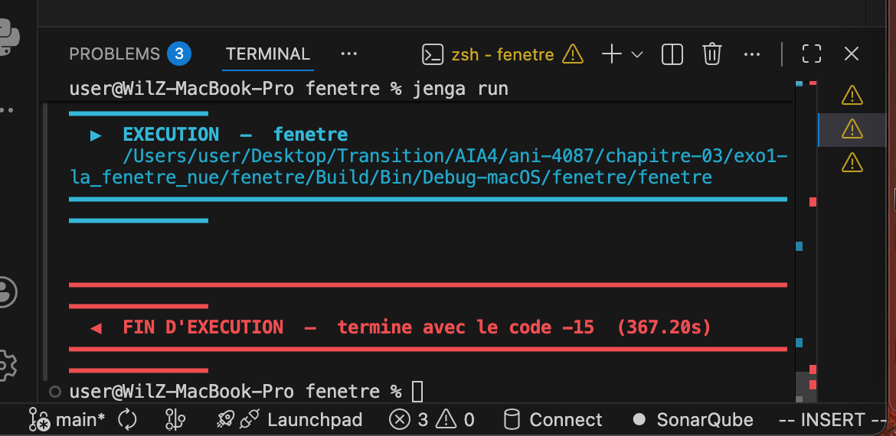
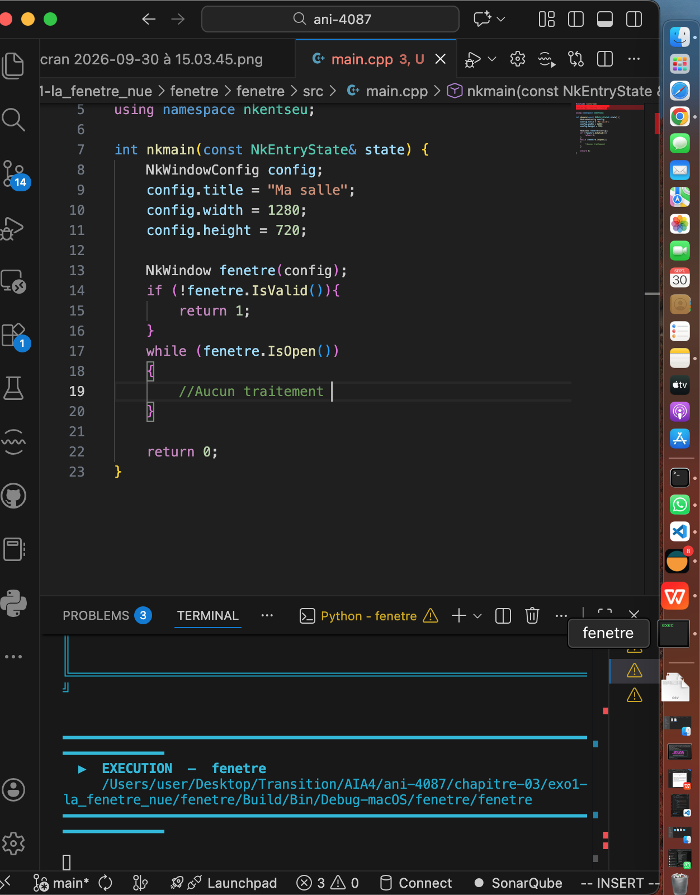

## Exercice 2 : La fenêtre qui ne répond pas
Remplacez le corps de la boucle par un commentaire, de façon à ne plus appeler PollEvents.

Lancez, attendez, et rendez une capture du moment où le système déclare la fenêtre bloquée. Chronométrez au bout de combien de secondes cela arrive sur votre machine.

# Reponse
Ici la boucle tourne sans appeler PollEvents(). Le programme continue à exécuter des instructions, mais ne traite plus le message destiné à la fenetre.
Ce qui se passe chez moi, le système considere que l'application ne répond pas, la fentre est la dans la barre de tache mais elle ne réagi pas, ne s'ouvre pas. Lorsque je force son arret, le programme s'arrete egalement dans le terminale et m'affiche fin d'execution comme vous pouvez le constater dans la capture ci-dessous

si je ne force pas l'arret, le programme va rester comme étant en cours d'execution mais l'écarn n'est pas active. vous pour le voir sur la capture d'écran suivante (la fenetre non ouverte se trouve dans la barre de tache)

L'absence de traitement des événements ne signifie pas nécessairement que le programme s'est arrêté. Elle signifie que l'application ne répond plus correctement aux demandes du système. ***PollEvents()*** est donc une opération indispensable au fonctionnement interactif de la fenêtre.